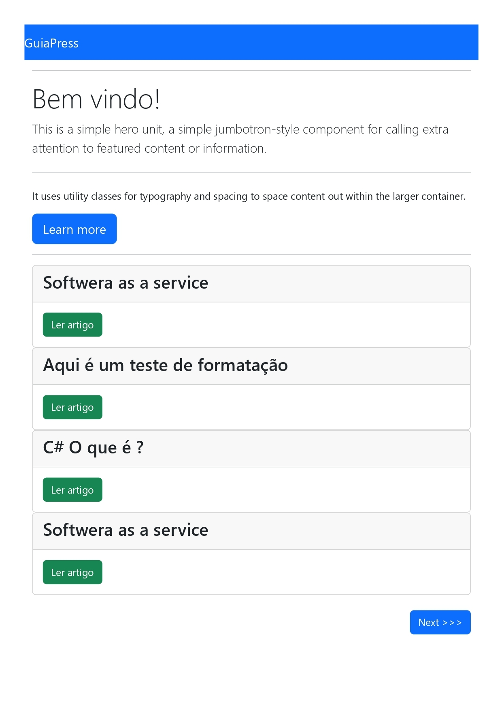

<h1 align="center"> Blog com Node.js </h1>

Projeto onde foi criado um blog utilizando o Node.js no backend e Bootstrap para o front-end  

  <a href="#-tecnologias">Tecnologias</a>&nbsp;&nbsp;&nbsp;|&nbsp;&nbsp;&nbsp;
  <a href="#-projeto">Projeto</a>&nbsp;&nbsp;&nbsp;|&nbsp;&nbsp;&nbsp;
  <a href="#-layout">Layout</a>&nbsp;&nbsp;&nbsp;|&nbsp;&nbsp;&nbsp;
  <a href="#memo-licença">Licença</a>

 

  

## 🚀 Tecnologias

Esse projeto foi desenvolvido com as seguintes tecnologias:

- HTML e CSS 
- Framework: Bootstrap
- JavaScript
- Node.js
    Bibliotecas utilizadas no Node.js:
      <code> 
        { 
          "bcryptjs": "^2.4.3", 
          "body-parser": "^1.20.2", 
          "ejs": "^3.1.9", 
          "express": "^4.18.2", 
          "express-session": "^1.17.3", 
          "mysql2": "^3.3.1", 
          "sequelize": "^6.31.1", 
          "slugify": "^1.6.6", 
          "tinymce": "^6.4.2" 
        }
      </code>
- Git e Github
- Mysql

## 💻 Projeto
<h1>Breve descrição</h1>
<h2>
Neste projeto foi realizado a criação de um Blog nele é possivel criar artigos, dividir os artigos criados de acordo com sua categoria. Os artigos criados são salvos num banco de dados Mysql. Toda parte lógica do backend foi feito em Node.js utilizando as tecnologias citadas, e o Front-end foi feito por meio do framework Bootstrap.
</h2>

- [Visite o projeto online]()

## 🔖 Layout

Segue algumas telas do projeto: 

  <h1>Tela inicial.</h1>
  
Nesta tela é apresentado uma lista dos ultimos artigos criados. Nela também temos um jumbotron onde pos ser colocado uma mensagem personalisada na Homepage do Blog.

  
 

 <h1>Tela Leitura de artigos.</h1>
   
Nesta tela é possivel realizar a leitura do Artigo 

  

 <h1>Tela criação de categoria.</h1>
 
Nesta tela é possivel realizar a criação/edição/exclusão do Artigo 

  

 <h1>Tela edição de artigos.</h1>
 
Nesta tela é possivel realizar edição de um arquivo já criado, nele sendo permitido formatações de textos, adicionar imagens e link, videos, tabelas e várias funcionalidades de um editor de texto moderno. 

  

 <h1>Tela de administração de usuários.</h1>
 
Nesta tela é possivel realizar manutenção dos usuários: criação/edição e exclusão 

  

